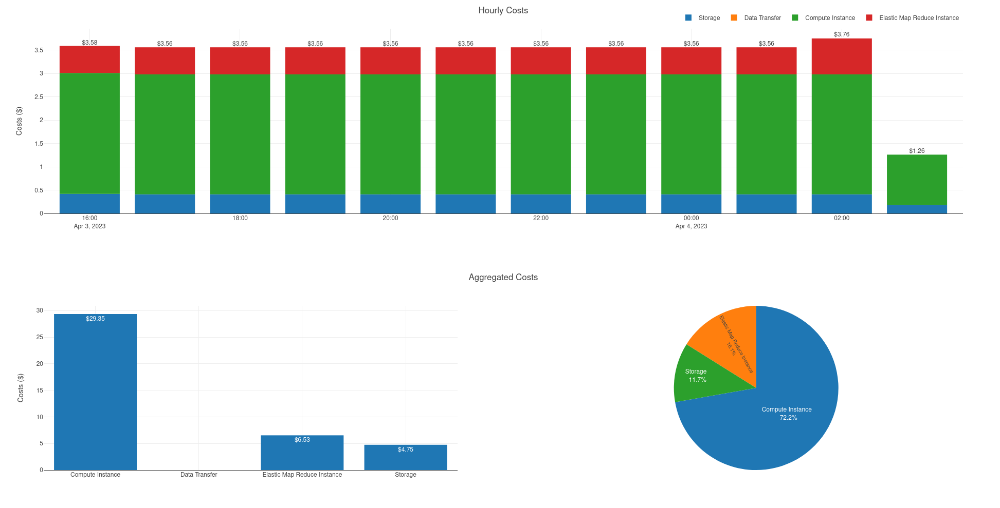
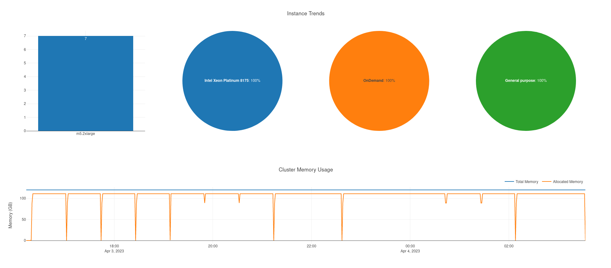

# EMR on EC2 - Cost Toolbox

This project contains example scripts and notebooks to generate Cost and Usage Reports for Amazon EMR clusters running on EC2. The project provides the following sample notebooks: 

- [emr-account-usage-report.ipynb](./notebook/emr-account-usage-report.ipynb) Provides account level details for expenses in the current month
- [emr-cluster-usage-report.ipynb](./notebook/emr-cluster-usage-report.ipynb) Provides detailed cluster expenses along with cost allocation by user and applications that were launched on the cluster

In order to compute costs for a single cluster, we use the following information: 

- [AWS Cost and Usage Reports](https://aws.amazon.com/aws-cost-management/aws-cost-and-usage-reporting/) that provides visibility about costs of AWS services (EMR, EC2, Storage, Data Transfer)
- YARN metrics of the cluster to retrieve information about total amount of resources available on the cluster that can be used by YARN applications
- YARN application metrics to generate costs allocation based on resources used by each application to have a final repartition of the costs by application usage

## Features

- Store YARN cluster and application metrics on an S3 bucket, so that they can be queried using analytics processing engines (e.g. Spark, Athena)
- Integrate with AWS Billing and Cost reports to generate cost details of an Amazon EMR on EC2 cluster
- Generate allocation of costs per application and users using a Jupyter notebook

## Requirements

In order to use the notebook, it is required to create an AWS Cost and Usage Report. This allows to generate syntetic billing reports for EMR clusters which in combination with the YARN metrics, allows to repartition costs in a multi-tenant cluster. To generate the Billing Report you can follow this [guide](https://docs.aws.amazon.com/cur/latest/userguide/use-athena-cf.html). When creating a new report, please make sure to select the following entries: 

- For **Report Content**, select **Include resource IDs** to include the IDs of each individual resource in the report.
- For **Report data time granularity**, select **Hourly** to generate cost split details for every hour of usage.
- For **Report data integration**, select **Amazon Athena** to generate parquet data as report output.

To install the [YARN metric reporter](./scripts/emr_usage_reporter.py) on an Amazon EMR cluster, copy the files [emr-install_reporter.sh](./scripts/emr-install_reporter.sh) and [emr_usage_reporter.py](./scripts/emr_usage_reporter.py) in an Amazon S3 bucket that you own. Then install the utility on each cluster for which you want to generate a cost allocation by application or user. 
To install the utility, submit an [Amazon EMR Step](https://docs.aws.amazon.com/emr/latest/ManagementGuide/emr-work-with-steps.html) in the cluster. You can use the EMR [script-runner.jar](https://docs.aws.amazon.com/emr/latest/ReleaseGuide/emr-commandrunner.html) providing as arguments: 1) the S3 path where you stored the scripts 2) the name of the Amazon S3 bucket where you want to store the YARN metrics collected. 

The script [emr-install_reporter.sh](./scripts/emr-install_reporter.sh) installs a crontab on the cluster to run the [emr_usage_reporter.py](./scripts/emr_usage_reporter.py) script every minute on the cluster to collect data. 
Below, a sample command to attach an EMR Step using the AWS CLI:

```bash
aws emr add-steps \
--cluster-id j-XXXXXXXXXXXXX \
--steps Type=CUSTOM_JAR,Name="Install YARN reporter",Jar=s3://REGION.elasticmapreduce/libs/script-runner/script-runner.jar,Args=[s3://MY-BUCKET/emr-install_reporter.sh s3://MY-BUCKET/emr_usage_reporter.py MY_REPORT_BUCKET]
```

In the previous command, please replace: 

- **REGION** with the AWS regions where the cluster is running (e.g. eu-west-1)
- **MY-BUCKET** with the name of the bucket where the script have been stored (e.g. my.artifact.bucket)
- **MY_REPORT_BUCKET** with the bucket name where you want to collect YARN metrics (e.g. my.report.bucket)


## (Optional) User Impersonation
To view job activity by Amazon EMR Studio users, you can configure user impersonation on a cluster. With user impersonation, each Spark job that is submitted from a Workspace is associated with the Studio user who ran the code.
To set up Spark user impersonation, set the following [configurations](https://docs.aws.amazon.com/emr/latest/ReleaseGuide/emr-configure-apps.html) while launching the EMR cluster:

```json
[
  {
    "Classification": "core-site",
    "Properties": {
      "hadoop.proxyuser.livy.groups": "*",
      "hadoop.proxyuser.livy.hosts": "*"
    }
  },
  {
    "Classification": "livy-conf",
    "Properties": {
      "livy.impersonation.enabled": "true"
    }
  }
]
```

In order to integrate with EMR studio the Hadoop HTTFS service should be running. To enable the service on EMR versions >= 6.4 you can submit the following EMR step while launching the cluster: 

```bash
aws emr add-steps \
--cluster-id j-XXXXXXXXXXXXX  \
--steps Type=CUSTOM_JAR,Name="Enable hadoop-httpfs",Jar=command-runner.jar,Args=[bash,-c,"sudo systemctl start hadoop-httpfs.service"]
```

## Usage
Once collected some data from an EMR cluster, you can then launch a Notebook (e.g. Sagemaker Studio, EMR Studio) attached to a cluster configured to use the AWS Glue Data Catalog. 
You can then import the notebooks [emr-cluster-usage-report.ipynb](./notebook/emr-cluster-usage-report.ipynb) and [emr-account-usage-report.ipynb](./notebook/emr-account-usage-report.ipynb) to generate reports for the cluster and account you want to audit. Below some sample visualization of the dashboards generated by the [emr-cluster-usage-report.ipynb](./notebook/emr-cluster-usage-report.ipynb) notebook. 





## Security

See [CONTRIBUTING](CONTRIBUTING.md#security-issue-notifications) for more information.

## License

This library is licensed under the MIT-0 License. See the [LICENSE](./LICENSE) file.